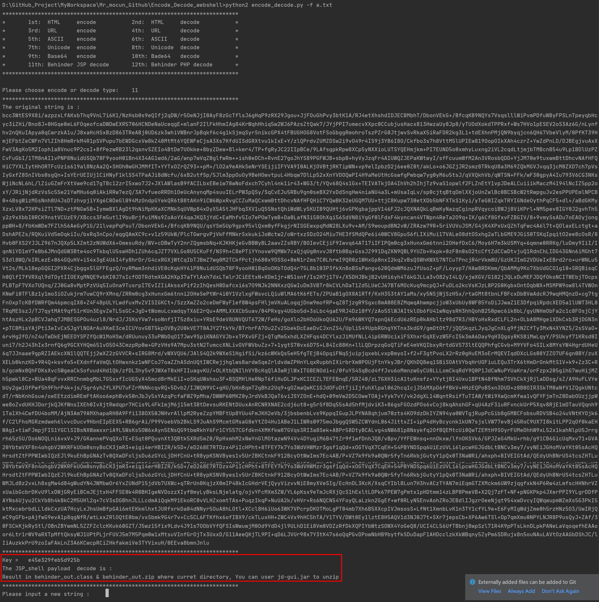
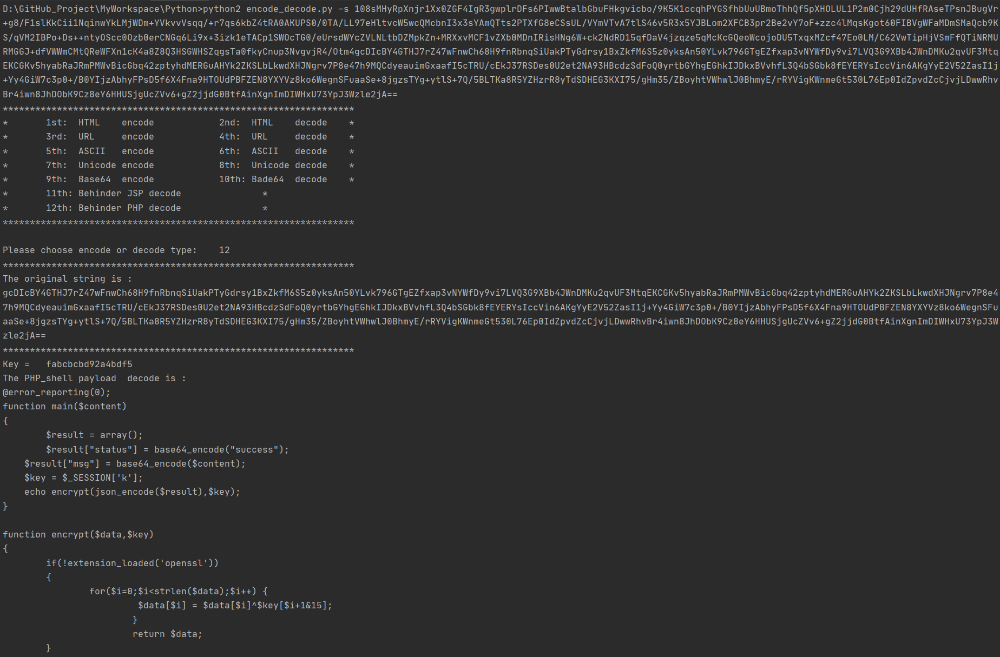

# Encode_Decode_webshell


**Current Version:  v1.0**

You can encoding or decoding string by this code, envy Behinder 2 ( or 3 ) JSP and PHP encryption traffic.

e.g.

- HTML encode and decode
- URL encode and decode
- ASCII encode and decode
- Unicode encode and decode
- Base64 encode and decode
- Behinder JSP decode
- Behinder PHP decode

---

## Usage

```bash
Usage : python2 encode_decode.py -s <string> -f <filename>

Options:
	-s 		target String
	-f		target Filname
```


**Encode_Decode requires python 2.X**

Operating System supported

----------------------------------------

- Windows XP/7/8/10
- GNU/Linux
- MacOSX


Moudle requires:

---

- cgi
- base64
- urllib
- HTMLParser
- pycryptodome
- re
- zipfile


**Warning：**

---

```
HTML encode requires Original string to be wrapped in ""
ASCII encode requires Original string is single number(0-255)
ASCII decode requires Original string is single character
If length(string) is too long , You must use the options -f Filename
If OS is windows , cmd code page must be 'chcp 936'
The Behinder default key = e45e329feb5d925b
```


**Example:**

---

```
e.g.1 HTML    encode:  python encode_decode.py -s "<div> </div>"
e.g.2 URL     encode:  python encode_decode.py -s http://www.baidu.com
e.g.3 ASCII   encode:  python encode_decode.py -s 97
e.g.4 Unicode encode:  python encode_decode.py -f behinder_jsp.txt 
e.g.5 Base64  encode:  python encode_decode.py -s abcdef
```

The unicode example is :


The Behinder JSP example is :

this key is default key (e45e329feb5d925b)




The Behinder PHP example is:




